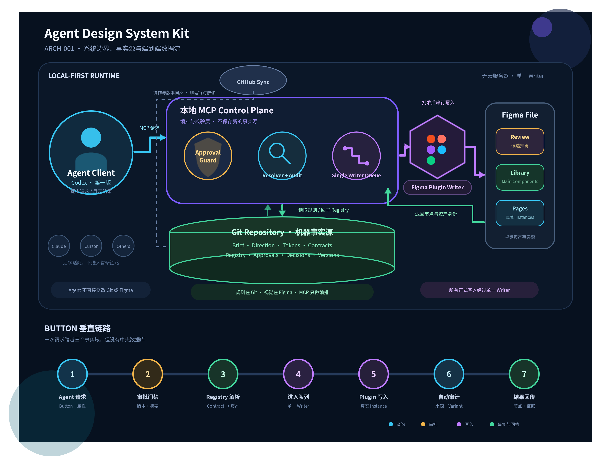

# ARCH-001：系统边界与端到端数据流

- 状态：冻结基线
- 决策日期：2026-08-26
- 依赖：DIR-001、DIR-002
- 适用范围：MVP 本地运行时架构

## 1. 架构目标

本架构需要支持：

- 多种 Agent 使用同一套设计系统事实；
- 设计规则、审批记录和视觉资产各自有明确事实源；
- Agent 不能绕过审批直接污染正式设计系统；
- Figma 所有正式写入由单一 Writer 串行执行；
- 同一操作可以被解释、重复验证和审计；
- 第一版不依赖自建云服务器、数据库或账号系统。

## 2. 总体架构



可编辑源文件：[diagram.svg](../diagrams/2026-08-26T061017/diagram.svg)；画板结构转换结果：[diagram.json](../diagrams/2026-08-26T061017/diagram.json)。

系统分为五个边界：

```text
Agent Client
→ Local MCP Control Plane
→ Local Git Repository
→ Figma Plugin Writer
→ Figma Design File
```

GitHub位于运行时之外，只负责协作、版本同步和发布，不是完成一次本地设计操作的必要依赖。

## 3. Agent Client 边界

第一版只正式支持 Codex。Claude、Cursor、Antigravity 等客户端通过同一 MCP Contract 在后续适配。

Agent Client 负责：

- 理解用户意图；
- 选择并调用 MCP Tool；
- 展示候选方案、审批状态和执行结果；
- 根据结构化错误决定下一步；
- 发起查询、评审申请、建库或页面插入请求。

Agent Client 不负责：

- 直接判断某个设计已经获得人工批准；
- 绕过 Registry 自行创建近似组件；
- 直接执行正式 Figma 写入；
- 把聊天上下文作为长期事实源；
- 通过任意文件修改绕过正式 Schema、审批和写入流程。

Agent 可以提出对 Git 中设计事实的变更，但该变更必须经过 Schema 校验、审批和 Git 记录后才成为正式事实。

## 4. Local MCP Control Plane 边界

本地 MCP Control Plane 是系统的编排与治理层，不是新的持久化事实源。

### 主要模块

| 模块 | 职责 |
| --- | --- |
| Tool Router | 向 Agent 暴露稳定 MCP Tools，并验证请求结构 |
| Schema Validator | 校验 Brief、Token、Contract、Registry 和 Approval |
| Approval Guard | 按 DIR-002 检查版本、摘要、角色决定和上游依赖 |
| Registry Resolver | 从逻辑组件解析到准确的 Figma 资产 |
| Audit Engine | 对比 Git 规则与 Figma 视觉资产，生成合规结果 |
| Writer Queue | 对所有 Figma 正式写入排队，保证单一 Writer |
| Operation Reporter | 返回步骤、节点身份、证据、警告和恢复建议 |

### 状态原则

- MCP 进程可以维护短期缓存和执行队列；
- 进程重启后，缓存丢失不应破坏正式事实；
- 长期规则必须来自 Git，长期视觉资产必须来自 Figma；
- 未完成操作需要通过 Operation Result 或后续审计恢复；
- 第一版不增加独立数据库。

## 5. Git Repository 与 GitHub 边界

### 本地 Git Repository

本地 Git Repository 是机器可读设计事实源，保存：

- Product Brief；
- UI Direction 定义和评审材料引用；
- Design Token；
- Component Contract；
- Component Registry；
- Approval Record；
- Decision Record；
- Schema 版本和迁移规则；
- 可进入版本控制的审计基线与示例。

### GitHub

GitHub负责：

- 多人同步和代码评审；
- 版本历史的远程备份；
- Release 和公开发布；
- Issue、贡献和商业授权联系。

GitHub暂不负责：

- 运行 MCP Server；
- 存储实时 Writer 队列；
- 充当登录或权限服务；
- 在用户离线时阻止本地设计工作。

## 6. Figma Plugin Writer 边界

Figma Plugin Writer 是唯一可以正式修改 Figma 文件的组件。

它负责：

- 接收经过校验和审批的写入命令；
- 创建或更新 Variables；
- 创建或更新 Main Component 和 Component Set；
- 插入真实 Instance；
- 设置 Component Properties 和 Variant；
- 返回 Figma 文件、页面、节点和组件身份；
- 在写入前后执行局部校验；
- 按稳定 ID 实现幂等写入。

它不负责：

- 自己决定设计值；
- 自己批准候选方案；
- 把 Figma 节点名称当作唯一身份；
- 在遇到冲突时猜测正确组件；
- 绕过 Writer Queue 并行修改正式资产。

MCP 与 Plugin 之间的具体本地通信方式由 `SPIKE-002` 验证，当前保留本地 HTTP 和 WebSocket 两种候选，不在 ARCH-001 提前决定。

## 7. Figma Design File 边界

Figma 是视觉资产事实源，保存：

- Review 区中的候选视觉方案；
- 正式 Variables；
- Main Components 和 Component Sets；
- 页面设计稿；
- Component Instances；
- 设计师实际评审时看到的视觉结果。

Figma 不保存以下事实的唯一版本：

- Token 的机器语义和版本历史；
- Component Contract；
- 人工批准是否合法；
- Registry 的跨系统映射；
- 为什么做出某项设计决定。

Figma 中的人工修改必须通过差异检测和新的审批流程同步回 Git，不能因为画布发生变化就自动成为正式规则。

## 8. 数据所有权

| 数据 | 正式事实源 | 镜像或引用 | 允许写入者 |
| --- | --- | --- | --- |
| Product Brief | Git | Agent Context | 受控 Git Workflow |
| UI Direction 定义 | Git | Figma Review、图片 | 受控 Git Workflow |
| Token 语义与版本 | Git | Figma Variables | 受控 Git Workflow |
| Approval Record | Git | Figma 评论、聊天仅作证据 | 真实人类决定 + 受控记录工具 |
| Component Contract | Git | Figma Component Properties | 受控 Git Workflow |
| Component Registry | Git | Figma 资产身份 | Registry Service |
| Main Component | Figma | Registry 引用 | Figma Plugin Writer |
| Page Instance | Figma | Operation Result、审计结果 | Figma Plugin Writer |
| Writer Queue | MCP 内存 | Operation Result | MCP Control Plane |
| 审计报告 | 本地输出；需要共享时进入 Git | Agent 展示 | Audit Engine |

核心原则：

> Git 负责“规则是什么”，Figma 负责“视觉资产是什么”，Registry 负责“二者如何准确对应”。

## 9. 接口边界

| 边界 | 协议或方式 | 当前状态 |
| --- | --- | --- |
| Agent ↔ MCP | Model Context Protocol | 已确定 |
| MCP ↔ Git Repository | 本地文件系统 + Git | 已确定 |
| MCP ↔ Figma Plugin | 本地 HTTP 或 WebSocket | 待 `SPIKE-002` |
| Plugin ↔ Figma File | Figma Plugin API | 待 `SPIKE-001` 验证具体能力 |
| Git Repository ↔ GitHub | Git push / pull | 已确定，非运行时依赖 |

所有跨边界请求都必须携带或可以解析出：

- `operationId`；
- `schemaVersion`；
- 目标项目；
- 目标对象稳定 ID；
- 目标版本或版本策略；
- 批准记录引用；
- 调用来源；
- 幂等键或等价信息。

字段的最终 Schema 由后续实现任务确定。

## 10. 建库数据流

```text
1. Agent 请求构建 Button
2. MCP 从 Git 读取 Token、Contract、Registry 和 Approval
3. Schema Validator 校验结构与引用
4. Approval Guard 校验版本、摘要、角色与依赖
5. Registry Resolver 判断资产是否已存在
6. Writer Queue 创建串行写入任务
7. Plugin 创建或更新 Variables 与 Component Set
8. Plugin 返回文件、节点、Component Key 和校验结果
9. Registry Service 记录稳定映射
10. Audit Engine 重新读取 Git 与 Figma，确认一致
11. MCP 向 Agent 返回结构化结果和证据
```

Registry 回写成功前，不得把操作报告为完整成功。Plugin 成功但 Registry 回写失败时，必须返回部分成功状态，并在下一次执行时通过稳定 ID 恢复，而不是重复创建。

## 11. 页面复用数据流

```text
1. 页面 Agent 请求 Primary / Default Button
2. MCP 搜索 Button Contract
3. Contract 校验属性组合
4. Approval Guard 确认 Component 仍为有效 approved
5. Registry 解析到准确的 Figma 资产
6. Writer Queue 下发 insert_instance
7. Plugin 在目标页面创建真实 Instance
8. Plugin 设置 Label、Appearance 和 State
9. Audit Engine 检查来源、Variant 与 Token
10. MCP 返回 Instance 身份、属性和审计结果
```

如果 Registry 解析不到唯一资产，流程必须停止或进入正式建库流程，不能由页面 Agent临时绘制按钮。

## 12. 审计数据流

Audit Engine 同时读取：

- Git 中的 Token、Contract、Registry 和 Approval；
- Figma 中的 Variables、Main Component、Variant 和 Instance。

输出至少包括：

- 检查对象和版本；
- 通过、警告或失败；
- Git 期望值和 Figma 实际值；
- 对应节点或文件路径；
- 修复建议；
- 是否允许继续正式写入。

Audit Engine 第一版只读，不直接修复。自动修复必须作为新的 Writer 操作重新进入审批和队列。

## 13. 信任与安全边界

### Agent → MCP

Agent 请求属于不可信输入，必须经过 Schema、范围、审批和目标校验。Prompt 中声称“已经批准”不能替代 Approval Record。

### Git → MCP

文件存在不代表合法。MCP 必须检查 Schema、版本、摘要、依赖和 Git 状态。

### MCP → Plugin

Plugin 只接受本地受信会话中的结构化 Writer Command。具体会话认证、来源限制和重放保护由 `SPIKE-002` 验证。

### Plugin → Figma

Plugin 必须检查目标文件和稳定资产身份。文件不匹配、身份冲突或重复组件时停止写入。

### Figma → Git

Figma 返回的节点属性属于实际状态，不会自动覆盖 Git 规则。差异必须先进入审计和人工决策。

## 14. 单一 Writer 与并发

- 所有正式 Figma 写操作进入同一个 FIFO Writer Queue；
- 同一项目同一时间只运行一个写任务；
- 查询和审计可以并行；
- 研究、方案生成和代码审查可以由多个 Agent 并行；
- Writer Command 必须使用幂等键；
- 队列不得依赖进程内自增编号作为长期身份；
- MCP 崩溃恢复后，通过 Git 和 Figma 实际状态重新判断，而不是假定上次失败或成功。

第一版的队列持久化方式由 `SPIKE-002` 和 ADR 决定。在没有数据库的前提下，优先选择可由文件状态安全恢复的方案。

## 15. 失败边界与恢复

| 失败位置 | 必须保证 | 恢复方式 |
| --- | --- | --- |
| Agent 请求失败 | Git、Figma 均不变化 | 修正请求后重试 |
| Git 校验失败 | 不进入 Writer Queue | 修复文件或审批 |
| Approval 失败 | 不进入正式写入 | 完成人工审批 |
| Plugin 未连接 | 不修改 Figma | 恢复连接并用同一幂等键重试 |
| Plugin 部分写入 | 不登记为完整成功 | 读取稳定 ID，继续或回滚 |
| Registry 回写失败 | 不重复创建 Figma 资产 | 重新定位资产并补写 Registry |
| 审计失败 | 保留资产但阻止后续正式使用 | 修复后重新审计 |
| GitHub 不可用 | 本地运行不受影响 | 稍后同步 Git |

## 16. 本地部署拓扑

第一版在同一台 Mac 上运行：

```text
macOS
├── Codex
├── Local MCP Server
├── Agent Design System Git Repository
├── Figma Desktop
│   └── Agent Design System Writer Plugin
└── Git Client
    └── GitHub Remote（可选同步）
```

不需要 Docker、云主机、远程数据库或反向代理。是否使用 Node.js 以及具体 Monorepo 工具由 `ADR-001` 在风险实验后确定。

## 17. ARCH-001 已确定事项

- Git 是机器可读设计事实源；
- Figma 是视觉资产事实源；
- GitHub 是协作与发布层，不是本地运行依赖；
- MCP 是编排与治理层，不建立新的永久事实源；
- Figma Plugin 是唯一正式 Writer；
- Agent 通过 MCP 完成设计系统运行时操作；
- 审批门禁位于所有正式写入之前；
- 查询和审计可以并行，写入必须串行；
- 第一版不增加云服务或数据库。

## 18. 留给风险实验的问题

### SPIKE-001

- Plugin API 能否稳定创建 Variables、Component Set、Variant 和 Instance；
- 能否取得适合 Registry 使用的稳定身份；
- Plugin 重新打开文件后如何定位既有资产；
- 部分写入后能否可靠检测并恢复。

### SPIKE-002

- 本地 HTTP 与 WebSocket 哪种更适合 Plugin 通信；
- Figma Plugin 的网络限制和 manifest 配置；
- 如何建立本地会话认证与来源限制；
- 如何实现请求响应、超时、断线重连和幂等重试；
- Writer Queue 是否需要本地文件日志。

ARCH-001 不提前替这些实验做决定。

## 19. ARCH-001 完成标准

- Agent、MCP、Git、GitHub、Plugin 和 Figma 的边界明确；
- 每类核心数据只有一个正式事实源；
- 建库、页面复用和审计数据流明确；
- 正式写入只有一条单 Writer 路径；
- 信任边界、失败边界和恢复责任明确；
- 待实验问题已经隔离到 `SPIKE-001` 与 `SPIKE-002`；
- 后续工程和风险实验可以直接引用本架构基线。
