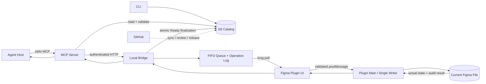

# DOC-002：当前架构与运行边界

> 本文描述当前仓库已实现的 Alpha，不把路线图当成现有功能。原始设计基线见 [ARCH-001](ARCH-001-系统边界与端到端数据流.md)，本文是实现后的运行时视图。

## 1. 一句话架构

Hatchkit 把 Git 中的设计规则与 Figma 中的视觉资产分开管理，由本地 MCP 校验和编排，再通过唯一的 Figma Plugin Writer 串行写入。



GitHub 不在一次本地查询或写入的运行链路中，因此第一版不需要自建服务器、数据库、账号系统或 Docker。

## 2. 五类事实分别存在哪里

| 事实                                                  | 权威来源           | 其他地方只保存什么                    |
| ----------------------------------------------------- | ------------------ | ------------------------------------- |
| Brief、Direction、Token、Component Contract、Approval | Git Catalog        | Agent Context 和 Figma 只是展示／投影 |
| Component Registry                                    | Git Catalog        | Figma 只保存 Marker，不代替 Registry  |
| Variable、Main Component、Instance 的真实视觉状态     | Figma 文件         | Registry 保存定位和版本证据           |
| 短期队列与当前会话                                    | Bridge 内存        | 不成为长期事实                        |
| 恢复与幂等证据                                        | 本地 Operation Log | 最近 30 天脱敏记录，不是数据库        |

关键规则：Git 定义“应该是什么”，Figma 记录“现在实际是什么”，Registry 记录“两者如何精确对应”。聊天上下文、节点名称和 Agent 猜测都不是事实源。

## 3. Monorepo 的四个正式 Package

```text
@agent-design-system-kit/core
          ↑
          ├── cli
          ├── mcp-server
          └── figma-plugin
```

| Package        | 职责                                                                                                    | 运行环境                                       |
| -------------- | ------------------------------------------------------------------------------------------------------- | ---------------------------------------------- |
| `core`         | Schema、摘要、Registry 解析、写入 Plan、协议、审计、统一 Result／Error                                  | 环境无关；禁止 `node:*`、DOM 和 Figma 全局对象 |
| `cli`          | 本地 Catalog 校验、搜索、精确解析与 Change Request                                                      | Node.js；只依赖 `core`                         |
| `mcp-server`   | stdio MCP Tools、Git 文件读取、Approval Guard、Local Writer Client、Bridge、Queue、Log、Registry 最终化 | Node.js；只单向依赖 `core`                     |
| `figma-plugin` | Plugin UI、Bridge Client、Figma Adapter、Variables／Button／Icon／Instance Writer 和三类审计            | Figma Sandbox + Plugin iframe；只依赖 `core`   |

Package 之间使用 `workspace:*`。CLI、MCP 和 Plugin 不相互依赖；环境 Adapter 不能把 Node 或 Figma API 泄漏进 Core。Figma 主线程最终由 esbuild 打包为 IIFE，不直接加载 Workspace ESM。

## 4. 三种运行模式

### 4.1 默认只读

```text
Agent → stdio MCP → Git Catalog
```

无 Bridge、无 Plugin、无 Figma 写入。提供：

- `hatchkit_status`；
- `hatchkit_query_briefs`；
- `hatchkit_query_directions`；
- `hatchkit_query_tokens`；
- `hatchkit_search_components`；
- `hatchkit_resolve_component`；
- `hatchkit_request_component_change`。

这是新用户和 Agent Host 的安全起点。

### 4.2 诊断 Bridge

```text
Agent／测试 → Bridge ↔ Plugin → Figma 读取与 ping
```

不传 `--project` 和 `--root` 启动 Bridge。它用于验证本地连接，没有 Git Approval Verifier，会失败关闭所有 Figma 写入。连接成功不等于写入授权。

### 4.3 Writer-enabled

```text
Agent → MCP → Git 重建 Plan → Bridge 写前再验证
      → FIFO → Plugin 实际写入 → 审计
      → Registry 原子最终化 → Result
```

必须同时满足：

- Bridge 使用准确 `--project` 和 `--root` 启动；
- MCP Host 通过进程环境获得 Loopback URL 和当前 Session Token；
- Plugin 连接并持有唯一 Writer 所有权；
- 当前 Figma 文件的 File Binding 匹配；
- Git Catalog、Registry、Component Contract 和 Approval 都能重新验证。

Writer-enabled MCP 在默认六个只读 Tool 之外增加：

- `hatchkit_insert_button_instance`；
- `hatchkit_audit_styles`；
- `hatchkit_audit_components`；
- `hatchkit_audit_registry_drift`。

其中三个 Audit Tool 经过 Bridge／Plugin 读取 Figma，但协议上是 `read_only_diagnostic`，不修改文件。

Bridge 只绑定 HTTP `127.0.0.1:38451`；Session Token 由 Bridge 启动时生成，默认八小时失效，断开或停止 Bridge 后立即失效。

## 5. Writer Protocol 当前能表达什么

Core 的版本化 Writer Protocol 定义八种命令：

| Command                     | 性质                                | 当前入口                                           |
| --------------------------- | ----------------------------------- | -------------------------------------------------- |
| `writer.ping`               | 只读连接诊断                        | Bridge／Plugin                                     |
| `variables.ensure`          | 幂等创建／收敛 Variables            | 底层 Writer 已实现，尚无面向 Agent 的公开 MCP Tool |
| `components.button.ensure`  | 幂等创建／收敛 Button Component Set | 底层 Writer 已实现，尚无面向 Agent 的公开 MCP Tool |
| `components.icon.ensure`    | 幂等创建／收敛 Icon Component Set   | 底层 Writer 已实现，尚无面向 Agent 的公开 MCP Tool |
| `instances.button.insert`   | 幂等插入真实 Button Instance        | `hatchkit_insert_button_instance`                  |
| `audit.styles.scan`         | 当前页样式审计                      | `hatchkit_audit_styles`                            |
| `audit.components.scan`     | 当前页组件来源审计                  | `hatchkit_audit_components`                        |
| `audit.registry-drift.scan` | 全文件 Registry 双向漂移审计        | `hatchkit_audit_registry_drift`                    |

因此，当前 Agent 公开黄金路径是“查询已 Ready Button → 精确解析 Variant → 插入 Instance → 三类审计”。Variables、Button 与 Icon 建库链路已有协议、Plan、Plugin Writer、幂等与审计，但尚未作为公开 MCP Tool 交给 Agent 自主调用。公开 Icon Registry 仍诚实标为 `unbuilt`，不能在缺少真实审批和 Figma Desktop 验收时冒充可插入资产。

## 6. Button Instance 端到端流程

1. Agent 只提交页面意图：准确 Button ID、Variant、Label、坐标和稳定 `requestId`；
2. MCP 每次从磁盘重读并校验 Catalog；
3. Registry Resolver 要求唯一 Active + Ready Component，并用 Contract 校验 Variant；
4. MCP 从 Git 中重建 Node ID、File Binding、Approval、版本和摘要，不接受 Agent 注入这些安全事实；
5. Local Writer Client 向认证 Bridge 提交严格 Writer Envelope；
6. Bridge 再次从 Git 验证 Approval，然后进入唯一 FIFO Queue；
7. Plugin 主线程校验协议、File Binding、Marker、Main Component 来源和 Variant；
8. Plugin 创建或返回同一稳定 Instance，设置 Label 和坐标；
9. 写后审计真实 Instance、Properties 和 Marker；
10. Result 沿 Plugin → Bridge → MCP 返回 Agent。

任一写前步骤失败都必须保持 Queue 和 Figma 零派发。

## 7. 一致性、幂等与恢复

Hatchkit 不把“命令发出了”当成成功，而是依次证明：

1. Git 规则与 Approval 有效；
2. Figma 目标文件和稳定身份唯一；
3. 实际结构与视觉属性已收敛；
4. 写后审计通过；
5. 需要时 Registry 已原子最终化。

三层幂等：

- Queue：`idempotencyKey hash + commandFingerprint`；
- Figma：Project、Asset、Major、Role／Slot／Instance ID 组成稳定身份；
- Registry：独占锁、乐观快照、原子替换和重载验证。

Figma 无跨节点事务，所以部分失败保留 `creating` Marker，并使用原请求继续收敛。正式 Writer 不暴露自动 Delete、Detach、Swap 或降级。详见 [FIG-007](FIG-007-Writer-Idempotency-Conflict-Recovery.md) 和 [故障排查手册](DOC-002-故障排查手册.md)。

## 8. 信任边界

| 输入边界                | 默认态度              | 必要校验                                                           |
| ----------------------- | --------------------- | ------------------------------------------------------------------ |
| Agent → MCP             | 不可信                | 严格 Schema、准确身份、Variant、范围；不接受口头 Approval          |
| Git 文件 → MCP          | 存在不等于合法        | 路径边界、文件大小、Schema、跨引用、摘要、版本、Approval           |
| MCP → Bridge            | 需认证                | 仅 HTTP `127.0.0.1`、Bearer Session Token、严格 Envelope、写前重验 |
| Plugin UI → Plugin Main | iframe 消息不直接信任 | 版本化消息与轻量深校验，与 Core Schema 对照测试                    |
| Plugin → Figma 文件     | 只修改当前文件        | File Binding、稳定 Marker、真实属性和唯一 Writer                   |
| Figma 实际状态 → Git    | 不自动反向覆盖        | 只读差异审计，变更需新 Contract／Approval／Writer 流程             |

Session Token 只存在当前 Bridge、MCP 和 Plugin Browser Client 内存；不进 URL、命令行参数、Git、Figma Storage 或 Operation Log。

## 9. 当前已验证与未完成

已由自动测试和双 Node CI 验证：

- 严格 Catalog、Registry 查询与 Button Variant 解析；
- 认证 Loopback Bridge、唯一 Writer、FIFO、租约、断线和 Operation Log；
- Variables、Button／Icon Component Set 与 Button Instance 的确定性 Writer 及幂等恢复；
- Approval 状态的 Queue 前失败关闭；
- 样式、组件来源和 Registry 双向漂移审计；
- Agent 黄金路径与系统失败矩阵。

仍需外部验收：

- 真实人类审批者对准确版本留下可信 Approval Record；
- 用户指定的独立 Figma Desktop 文件中完成 FIG-003 至 FIG-006 双次运行、重开定位与视觉验收；
- 面向 Agent 的 Variables／Component 建库 MCP Tools；
- Icon 真实审批、Figma Desktop 建库验收与 Instance 插入，Input 组件链路；
- 图形化安装器、多 Agent Writer、云服务和完整组件库。

这些未完成项不影响当前只读 Catalog 和自动 Harness 的使用，但不能在发布说明中写成已交付功能。
